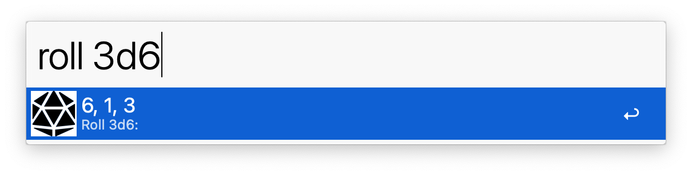
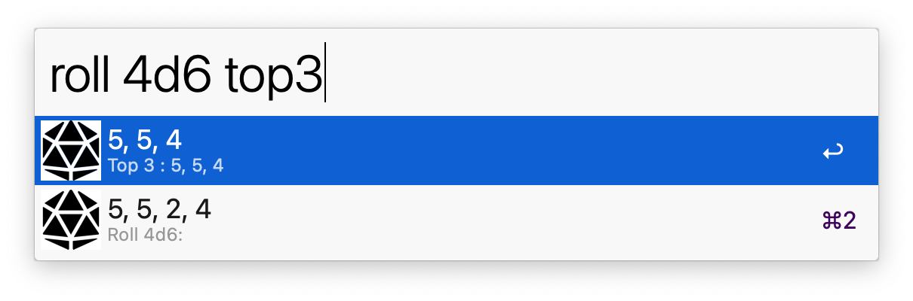
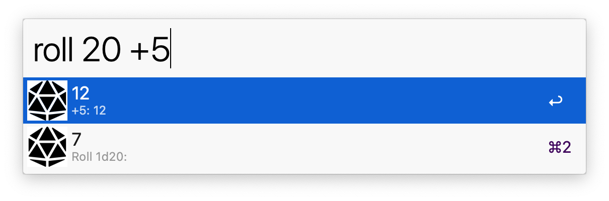

# Alfred Die Roller

This is a workflow for rolling dice and operating on them, suited to Tabletop Games like *Dungeons & Dragons* and *Shadowrun*. Copies result to clipboard. 

## Actions

 * `X` - Roll one X sided die
 * `XdY` - Roll X number of Y-sided dice
 * `sum` - Sum dice after rolling
 * `topX` - Get X largest dice
 * `bottomX` - Get X smallest dice
 * `>4` - Get number of dice > 4
 * `+x/+y` Add +x and +y to the first two dice rolled 

## Examples

### Roll 3d6

`roll 3d6`

### Sum Result

`roll 3d6 sum`

### Roll 4d6, drop lowest

`roll 4d6 top3`

### Get number of dice > 4

`roll 10d6 >4`

### Modify dice

`roll 1d20 +5`

`roll 2d20 +3/*5`

### Combine 

`roll 5d20 top2 sum`

